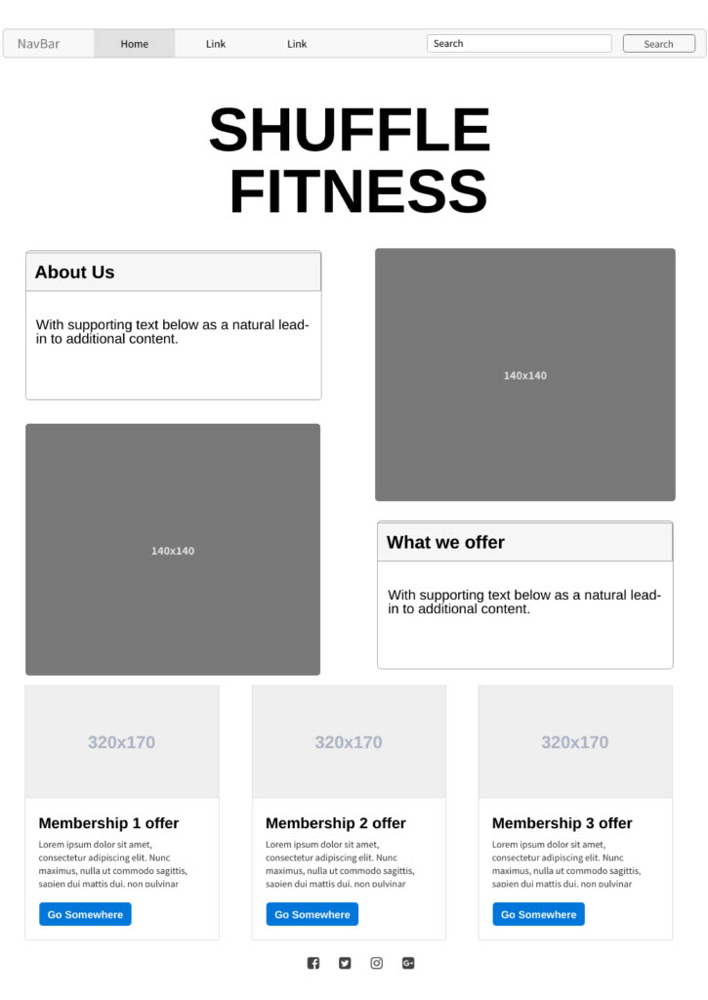
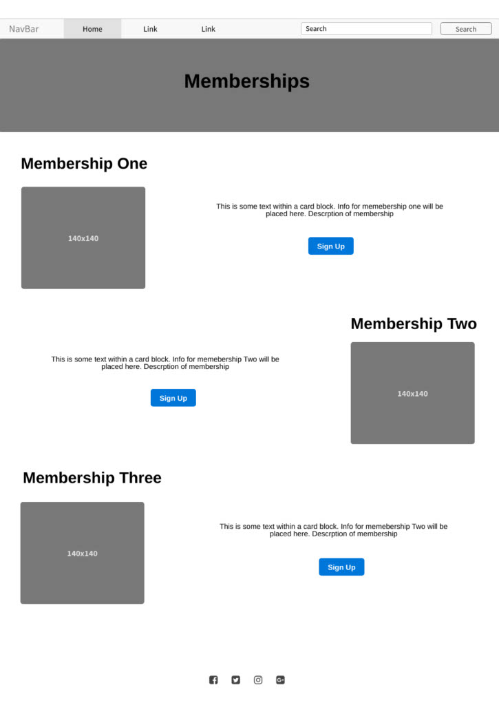
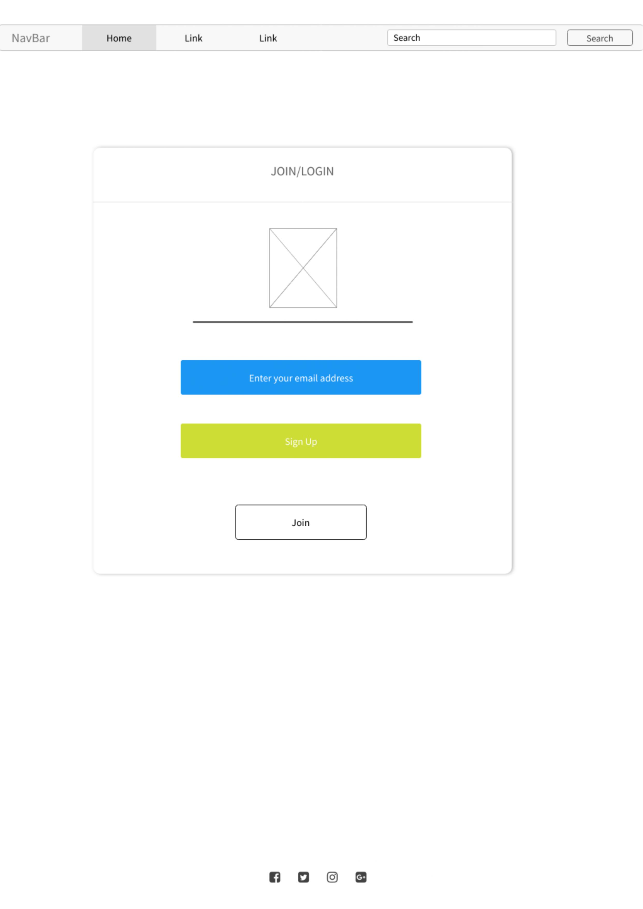
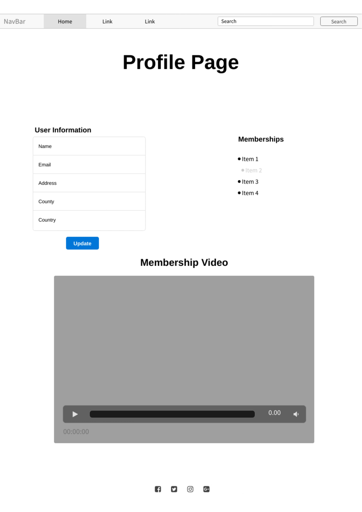
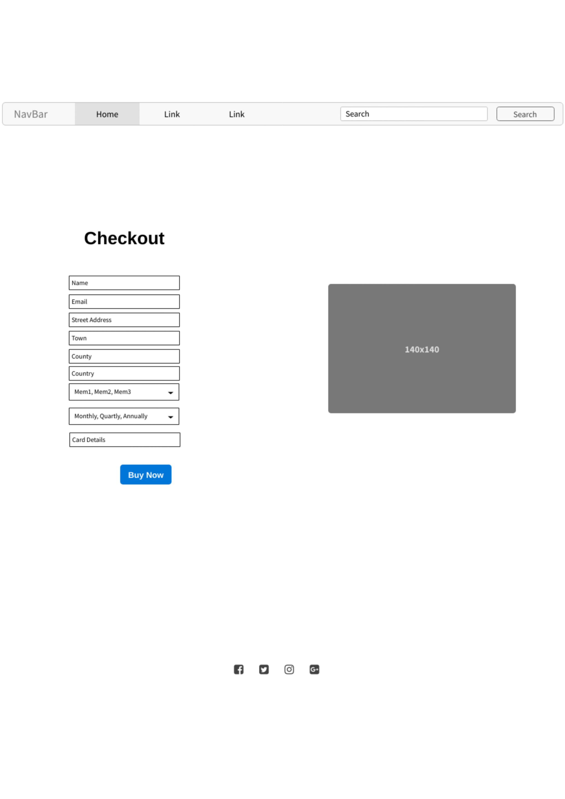

# shuffle-fitness-ms4

This is a full-stack web application using Django framework alongside HTML, CSS, Python and JavaScript.

This application is for a fictional fitness and nutrition company called Shuffle Fitness. The application will allow users to select an fitness subsrciption that suits them, they will be able to set-up payment using stripe. The user will need to create an account to be able to access paid for material, the user will also be able to rate the material that they have purchased. Some other features that this site will use are confirmation emails, CRUD for the admin to create new content and control the database. 

This webpage is for educational purposes and the stripe functionality will only accept test card details.

* To use the stripe card payment please use the following card information:
    * Card Number: 4242 4242 4242 4242
    * Any Date or you can use: 04/24
    * Any CVV Number

### Unforunately this is not complete and I have had to submit this site while not being 100% ready. I do apologise for the inconvience for this! I understand that this will be a fail and I will make sure that I work very hard to make it a pass on the potential resubmission date.

## **Table of Contents**
* [1.**UX**](#1-ux)
    * [**User Stories**](#user-stories)
    * [**Wireframes**](#wireframes)
    * [**Design**](#design)
* [2.**Database Design**](#2-database-design)
* [3.**Features**](#3-features)
    * [**Existing Features**](#exisiting-features)
    * [**Features to implement in the future**](#features-to-implement-in-the-future)
* [4.**Technologies Used**](#4-technologies-used)
* [5.**Deployment**](#5-deployment)
* [6.**Credits**](#6-credits)
* [7**Acknowledgements**](#7-acknowledgements)

## 1. **UX**
Overview of the UX design including the wireframse which have been created as a foundation for the site.

### **User Stories**
* Customers
    * Web Experience
        * As a customer, I would like to see what the options for fitness and nutrition are on the site.
        * As a customer, I want the site to be easy to navigate.
        * As a customer, I would like to see plenty of information on the company.
        * As a customer, I would like to be able to login securely.
        * As a customer, I would like to be able to send an email to the company. 
    * Shopping/Purchase
        * As a customer, I would like to have a good description of the different plans that are offered.
        * As a customer, I would like to have use of a shopping cart.
        * As a customer, I would like to be able to edit the shopping cart if needed.
        * As a customer, I would like to use a secure checkout.
        * As a customer, I would like to see confirmation when I successfly complete a task.
    * Searching
        * As a customer, I would like to see all the subscriptions that are offered.
        * As a customer, I would like to search by category or with a simple word search. 
    * Account
        * As a customer, I would like to have my details saved to an account. 
        * As a customer, I would like to be able to access my purchase on my profile.
        * As a customer, I would like to leave a rating for the products that I have purchased.
* Admin User, Business Owner
    * As the business owner, I would like to be able to add, edit and delete products with ease.
    * As the business owner, I would like my customers to enjoy using the website.
    * As the business owner, I would like to have access to a admin section.

### **Wireframes**
To create my wireframes I used a website called MockFlow. The JPEG of the wireframes are attached bellow. 
#### Home/Landing Page

#### Membership/Product Page

#### Login Page

#### Profile Page

#### Checkout Page

### **Design**
The design of this site will be simplistic, but with images that bring out some life onto the site. There will be little bits of colour, to break up the white and black text. 

The site needs to be a Mobile First design, so that it can work on mobiles, tablets and also laptops and desktop screens. The images, buttons and forms are all kept to a straight edge rather than rounded to give the site a stronger feel.

The navbar will collapse into a dropdown for the small screens, with search functionality.

Within the footer there will be social links and contact info, so that the user can further connect with the site owner. 

Toasts will pop up to give a success message or even a warning message. 

## **Database Design**

 

