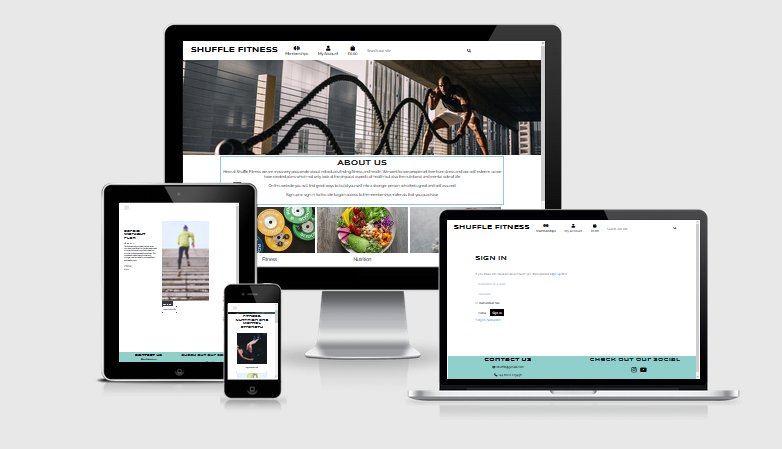
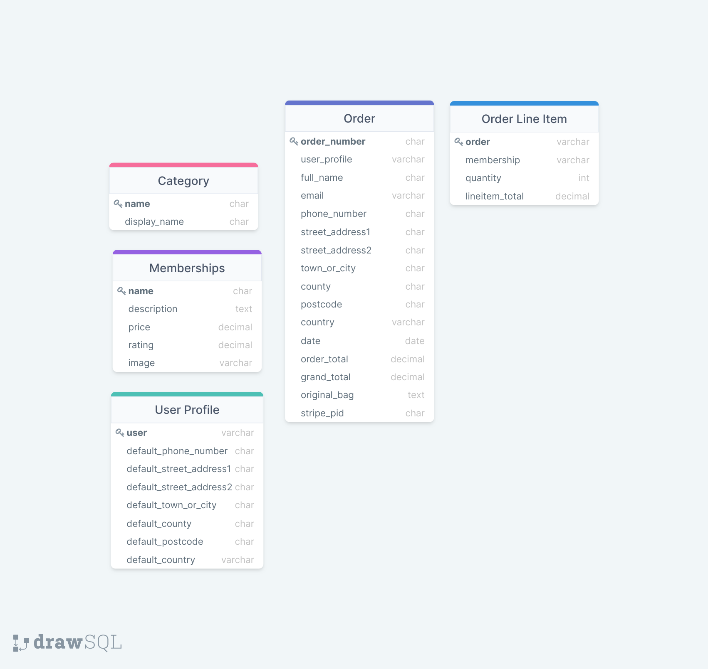

# shuffle-fitness-ms4

## **Table of Contents**
* [1.**UX**](#1-ux)
    * [**User Stories**](#user-stories)
    * [**Wireframes**](#wireframes)
    * [**Design**](#design)
* [2.**Database Design**](#2-database-design)
* [3.**Features**](#3-features)
    * [**Existing Features**](#exisiting-features)
    * [**Features to implement in the future**](#features-to-implement-in-the-future)
* [4.**Technologies Used**](#4-technologies-used)
* [5.**Deployment**](#5-deployment)
* [6.**Credits**](#6-credits)
* [7**Acknowledgements**](#7-acknowledgements)

This is a full-stack web application using Django framework alongside HTML, CSS, Python and JavaScript.

This application is for a fictional fitness and nutrition company called Shuffle Fitness. The application will allow users to select an fitness subsrciption that suits them, they will be able to set-up payment using stripe. The user will need to create an account to be able to access paid for material, the user will also be able to rate the material that they have purchased. Some other features that this site will use are confirmation emails, CRUD for the admin to create new content and control the database. 

This webpage is for educational purposes and the stripe functionality will only accept test card details.

* To use the stripe card payment please use the following card information:
    * Card Number: 4242 4242 4242 4242
    * Any Date or you can use: 04/24
    * Any CVV Number

## 1. **UX**
Overview of the UX design including the wireframse which have been created as a foundation for the site.

### **User Stories**
* Customers
    * Web Experience
        * As a customer, I would like to see what the options for fitness and nutrition are on the site.
        * As a customer, I want the site to be easy to navigate.
        * As a customer, I would like to see plenty of information on the company.
        * As a customer, I would like to be able to login securely.
        * As a customer, I would like to be able to send an email to the company. 
    * Shopping/Purchase
        * As a customer, I would like to have a good description of the different plans that are offered.
        * As a customer, I would like to have use of a shopping cart.
        * As a customer, I would like to be able to edit the shopping cart if needed.
        * As a customer, I would like to use a secure checkout.
        * As a customer, I would like to see confirmation when I successfly complete a task.
    * Searching
        * As a customer, I would like to see all the subscriptions that are offered.
        * As a customer, I would like to search by category or with a simple word search. 
    * Account
        * As a customer, I would like to have my details saved to an account. 
        * As a customer, I would like to be able to access my purchase on my profile.
        * As a customer, I would like to leave a rating for the products that I have purchased.
* Admin User, Business Owner
    * As the business owner, I would like to be able to add, edit and delete products with ease.
    * As the business owner, I would like my customers to enjoy using the website.
    * As the business owner, I would like to have access to a admin section.

### **Wireframes**
To create my wireframes I used a website called MockFlow. The JPEG of the wireframes are attached bellow. 
#### Home/Landing Page

#### Membership/Product Page

#### Login Page

#### Profile Page

#### Checkout Page

### **Design**
The design of this site will be simplistic, but with images that bring out some life onto the site. There will be little bits of colour, to break up the white and black text. 

The colour I have chosen to use just to break up the white background and black text is #8FD0CA, which is a light blue, with a hint of grey. 

The buttons are a mix of black and white, each has the opposite colour for the font.

#### Font Family
The font family that I have chosen to use are from google fonts. I have used two fonts throughout my site one for main titles/headers and the other for all other text. 
    - For titles and headers I used Syncopate with a backup of sans-serif.
    - For all other text I used Raleway also with a backup of sans-serif.

#### Images
Images are used throughout this site, all the images have been selected from Unsplash. 

There are two main hero images, one is on the landing page and the other is on the membership page. I used the hero images to give the site more life and also to grab the users attention.

##### Icons
* Through out this project I have used icons provided by [Font Awesome](https://fontawesome.com/) they are used in my navbar and also within my footer.

## **Database Design**

## **Features**
* Header & Navbar
    * The Navbar is positioned at the top of each page, and is can be accessed with ease.
    * The Navbar collaspes when the screen size changes to smaller screens.
    * At the left of the Navbar you have the company name in bold and caplitised letters, this is to draw attention so that the user knows the site they are visiting.
* Search
    * A search box can be found within the Navbar and is accessible on every page of the site. 
    * The search bar collapses with the rest of the Navbar when on mobile screens
    * The user can search keywords that link to a membership they wish to find more information about.
* Toasts
    * They appear on every page whenever the user makes a certian action that prompts a response. 
    * These messages will pop up in the right hand corner and can be closed with a click on the button. 
    * They give feedback to the user on actions such as logging in or out, adding a membership to the bag and also warnings, for example when editing a membership.
* Buttons & Links
    * all the buttons have a consistent colour scheme.
    * Every button will take the user to their desired location.

* Django Allauth feature
    * Django Allauth is a python package, I have used this, as it has features such as signup, login, logout and password change. These are all needed for the user to access the site correctly. 
    * Once signed up, an email verification will be sent to the user's email to confirm. Once this is confirmed they will have access to their purchased memberships.

* Emails 
    * Automatic emails are working in this project and the user will recieve confirmation emails.

* Footer
    * The footer will be found at the bottom of every page.
    * There are social links for the users to further connect with the company.

* The Django Apps
    * Home
    * Memberships
    * Checkout
    * Bag
    * Profiles

* Pages on Site 
    * Home Page
        This is the base page for all users, once logged in you will be redirected here, also for user who are not logged in this will be where they land.
    * Membership Page
        Here all the memberships which are on offer are found. 
    * Membership Detail Page
        Once a user clicks on a membership offer they like the look of, they will be taken to another page which holds all the info and price for that chosen membership.
    * Profile Page
        Here the user, once logged in will be able to see their past purchase and they are able to correct any personal details if they would like to.
    * Product Management Page
        This page can only be accesed by the admin, and here the admin can manage the products.
    * Login Page
        This gives the user the ability to login into the site.
    * Register Page 
        Here a new user can register their details in order to use the site see their own memberships.
    * Logout Page
        The user is able to logout safely and will be redirected to the homepage.
    * Checkout Page
        Here the user is able to purchase the item they have chosen. It is a form which uses stripe payments.
    * Checkout Success Page
        This page confirms to the user that their order was succesfull.

* Future Features
    * To have a way that the user can view videos from within their profile, and have access to a full membership worth of material. 
    * Give the users an ability to talk to a personal trainer in a live chat and for the user to have a chance to speak to a counsellor via a live chat.
    * Have an option of monthly payments rather than a lump sum. 

## **Technologies Used**
#### Languages Used
  - [HTML5](https://en.wikipedia.org/wiki/HTML5)
  - [CSS3](https://en.wikipedia.org/wiki/Cascading_Style_Sheets)
  - [JavaScript](https://en.wikipedia.org/wiki/Javascript)
  - [Jquery](https://en.wikipedia.org/wiki/JQuery)
  - [Python](https://www.python.org/)

#### Frameworks

- [Bootstrap 4](https://validator.w3.org/) library was used to create a responsive site.
- [Font Awesome](https://fontawesome.com/) Used for social icons and nav icons
- [Google Fonts](https://fonts.google.com/) I used this for the two chosen fonts. 
- [Django](https://docs.djangoproject.com/en/3.2/) Django is a high level Python Web Framework
- [Stripe](https://stripe.com/) Is used to allow users to make payments. 
- [Heroku](https://www.heroku.com/) Heroku is the cloud platform to deploying the app.
- [Github](https://github.com/) GitHub is used to host the project files.
- [GitPod](https://www.gitpod.io/) GitPod, connected to GitHub, hosted the coding space and allowed the project to be committed to the Github repository.
-[Git](https://git-scm.com/) Git is used to allow for tracking of any changes in the code and for the version control.
- [AWS](http://aws.amazon.com/) Amazon Web Services (AWS) is the most comprehensive and broadly adopted cloud platform used for S3 service.
- [Mockflow](https://mockflow.com/) Is a wireframe creator website.
- [Postgres](https://www.postgresql.org/) - PostgreSQL is one of the world's most popular database management systems.
## **Deployment**
### Heroku Deployment
  1. Set up local workspace for Heroku
     - In terminal window of your IDE type: pip3 freeze -- local > requirements.txt. (The file is needed for Heroku to know which filed to install.)
     - In termial window of your IDE type: python app.py > Procfile (The file is needed for Heroku to know which file is needed as entry point.)
  2. Set up Heroku: create a Heroku account and create a new app and select your region.
  3. Deployment method 'Github'
     - Click on the Connect to GitHub section in the deploy tab in Heroku.
       - Search your repository to connect with it.
       - When your repository appears click on connect to connect your repository with the Heroku.
    - Add PostgreSQL Database
       - Click the resources tab.
       - Under Add-ons seach for Heroku Postgres and then click on it when it appears.
       - Select Plan name Hobby Dev - Free and then click Submit Order Form.
    - Goto CLI
       - pip3 install dj_database_url
       - pip3 install psycopg2-binary
       - pip3 freeze > requirements.txt
    - Go to settings.py
       - import OS
       - import dj_database_url
       - Add postgres url and comment sqlite
    - Migrate data
    - Dumpdata from sqlite and loaddata to postgresql
    - pip3 install gunicorn
    - pip3 freeze > requirements.txt
    - Create Procfile
    - Set DISABLE_COLLECTSTATIC=1
    - In settings.py set ALLOWED_HOSTS
    - Git add, commit and push.
    - Git push heroku master
    - Go to the settings app in Heroku and go to Config Vars. Click on Reveal Config Vars.Enter the variables.
       - AWS_ACCESS_KEY_ID
       - AWS_SECRET_ACCESS_KEY
       - DATABASE_URL
       - EMAIL_HOST_PASS
       - EMAIL_HOST_USER
       - SECRET_KEY
       - STRIPE_PUBLIC_KEY
       - STRIPE_SECRET_KEY
       - STRIPE_WH_SECRET
       - USE_AWS 
  4. Automatic deployment: Go to the deploy tab in Heroku and scroll down to Aotmatic deployments. Click on Enable Automatic Deploys. By Manual deploy click on Deploy Branch.

  Heroku will receive the code from Github and host the app using the required packages. Click on Open app in the right corner of your Heroku account. The app wil open and the live link is available from the address bar. 

- ### Forking
  If you wish to contribute to this website you can Fork it without affecting the main branch by following the procedure outlined below.
  1. Go to the GitHub website and log in.
  2. Locate the [Repository](https://github.com/Dgoodwin92/shuffle-fitness-ms4) used for this project.
  3. On the right-hand side of the Repository name, you'll see the 'Fork' button. It's located next to the 'Star' and 'Watch' buttons.
  4. This will create a copy in your personal repository.
  5. Once you're finished making changes you can locate the 'New Pull Request' button just above the file listing in the original repository.

- ### Cloning 
  If you wish to clone or download this repository to your local device you can follow the procedure outlined below.
  1. Go to the GitHub website and log in.
  2. Locate the [Repository](https://github.com/Dgoodwin92/shuffle-fitness-ms4) used for this project.
  3. Under the Repository name locate 'Clone or Download' button in green.
  4. To clone the repository using HTTPS click the link under "Clone with HTTPS".
  5. Open your Terminal and go to a directory where you want the cloned directory to be copied in.
  6. Type `Git Clone` and paste the URL you copied from the GitHub.
  7. To create your local clone press `Enter`

### AWS 
  1. Create a new Amazon account and connect to the amazon service AWS3. your account will be a cloud based service where the project media and staicfiles will be stored. At first, we locate S3 on amazon service then you create a bucket. While creating the bucket on S3, note that public access must be all switched off to allow access for all users.

  2. Once we've created the bucket, we now can now click on the properties and enable the static Website hosting option, so it can serve the purpose of hosting our static files. You will need to input an index.html. Then we go into the created bucket permissions and click into CORS configuration, this part already have a prefilled default config, you will need to write the default code and save the config.

  3. Then go into the bucket policy to allows access to the contents across all web and inside this you will put some code including arn address displayed at the top of the heading. Then go into amazon IAM to allow identity and access management of our stored files and folder. In the IAM service, add a new group for your application and set the policies to all then it generates a downlaodable zip file containing ID and KEY for you to use in the newly created group. This ID and KEY are to be stored as an environment variable.

  4. This then allows to head back to your terminal window, you will need to  install the settings Boto3 and Django Storages.

  5. The Django Storages is passed into the installed apps in settings and also a custom_storage.py file is created to store credentials in environment variable. Once everything is ready run python3 manage.py collectstatic. This will collect all the static files in the app including any changes that is made, this command has to be run in the development(local) environment each time a change is been made in the static files/folder And your folder and files should display in your AWS S3 BUCKETS.

## **Credits**
* All the code has been written by Daniel Goodwin

* [Bootstrap 4](https://getbootstrap.com/) library was used to create a responsive site.

* To help me along the way, I refered back to the Boutique Ado videos (this was a project from Code Institute).

* To help with the content of the website, I took inspiration from:
    * [Daily Burn](https://lp.dailyburn.com/byrdie/index.html)
    * [Obe Fitness](https://obefitness.com/)

* [Unsplash](https://unsplash.com/) was used for all the images on the site.
* [DrawSQL](https://drawsql.app/) was used to create my Data Schema image.
* I used [Color-Name](https://www.color-name.com/popular) as a tool to help me pick colours.
* [Google Fonts](https://fonts.google.com/) was used to choose two fonts for the site.

## **Acknowledgements**
* A huge shout out to the Code Institue tutors, as without them I never would have come close to finishing this project. These guys are amazing!
* A big thank you to my wife, for pushing me and reminding me that I can complete this. 

 

