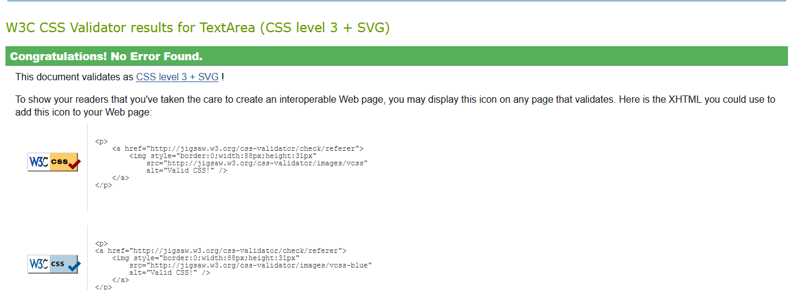
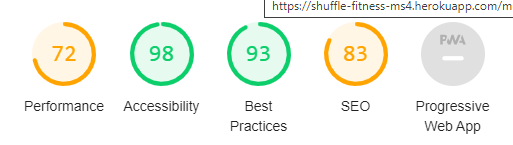

# Shuffle Fitness Testing
- [**Validation**](#validation)
    * [W3 HTML](#w3-html)
    * [W3 CSS](#w3-css)
    * [JavaScript](#javascript)
    * [Python](#python)
- [**Testing User Stories**](#testing-user-stories)
- [**Issues I Faced**](#issues-i-faced)
- [**Issues Still to fix**](#issues-still-to-fix)
- [**Performance Testing**](#performance-testing)

## **Validation**

### W3 HTML
To  my HTML, I used [W3 Validation Service](https://validator.w3.org/)
* There is one error within the checkout.html, if a user is not logged in this error will appear 
    
    - However if you are logged in there is no error. 
    
* There is a warning on every page about the javascript, however I do not see this as an issue.
    

### W3 CSS
I  the CSS with the [W3 Validation Service](https://jigsaw.w3.org/css-validator/)
* All my CSS passed within static folder

* All the CSS in checkout app passed

### JavaScript
I  the JavaScript with [JSHint](https://jshint.com/).
* all the JavaScript code is clean.

### Python
I validated all of my Python code via the website [Pep8 Online Validator](http://pep8online.com/)
There are no errors from within my Python code and the code is PEP8 compliant.

## **Testing User Stories**
* Normal User
    * This is an easy to navigate site, with a structured layout and I do not get confused when navigating.
    * The home page is clear and appealing and I have access to everything I need. 
    * The nav links work well and are well presented.
    * Any external links, i.e. social links open up the relevant social media sites.
    * This site can be used on any device.
    * I am able to register as a new user, which is simple and I recieve an email to confirm my registration. 
    * Once logged in I am able to update my profile information, and I can see any of my past purchases.
    * It is great to see that I have successfully added something to the bag with the toasts popping up to feedback to me. 
    * The forms are easy to use and fill out, if I miss an important piece of information, the form will not submit. 
    * Once I have paid, there is a user friendly checkout success page, with important information on it.
* Admin User
    * As the site owner I can check on all the memberships and update if needed. 
    * I am able to delete old memberships, edit and add new memberships to the site. 
    * As site owner I still have all the functionality as a regular user aswell.
* New Users who want a membership
    * I can create a user profile by signing up.
    * It is easy to login and view my profile.
    * I can add to the bag or remove memberships from the bag. 
    * I feel that my information is secure.
    * I can see all my purchases in my profile.
    * There is links to the company's social media, a contact email and phone number. 

## **Issues I Faced**
* I face an issue with my toasts not closing, this was fixed when I noticed that I was using a different version of bootstrap for CSS and JavaScript.
* The footer would jump up the page on sign out and empty bag pages, but this was fixed with a wrapper div, and pushed the footer down on pages with little content. 
* I had some issues with the webhandlers, mainly because of a typo from withing my python code, after some help from a tutor I was able to fix this. 
* During setting up the login functionality, when a user would login it would take the user to a 404 page called success, I struggled to find the fix for this. By chance when looking in my settings for something else, I stumbled across LOGIN_REDIRECT_URL = 'success/' and so was able to change it to the correct code LOGIN_REDIRECT_URL = '/'.

## **Issues Still to fix**
* Image sizes on membership detail page, the images need to be a little smaller and not so stretched. 
* It would be great to have more content to add to user profiles when they purchase a membership. 

## **Performance Testing**
### Compatibility Testing
* Browser Compatibility
    * Tested on Chrome, Firefox and Microsoft Edge
* OS Compatibility
    * Tested on iOS and Andriod 10
* Tested for responsivness using [Chrome DevTools](https://developer.chrome.com/docs/devtools/)

### Usability
* This website was shared with family and friends to see how it worked on different devices and screens. 

### Lighthouse Report in Chrome DevTools
* Home page Mobile
    
* Home page Desktop
    
* Membership page Mobile
    
* Membership page Desktop
    
* Membership Detail page Mobile
    
* Membership Detail page Desktop
    
* Mobile Bag page
    
* Desktop Bag page
    
* Mobile Checkout page
    
* Desktop Checkout page
    
* Mobile Checkout Success page
    
* Desktop Checkout Success page
    
* Mobile Register page
    
* Desktop Register page
    
* Mobile Sign In page
    
* Desktop Sign In page
    
* Mobile Membership Management page
    
* Desktop Membership Management page
    
* Mobile Profile page
    
* Desktop Membership Management page
    

#### Tested on Developer Tools Lighthouse.
- To run a report

    1. Download Google Chrome for Desktop.
    2. In Google Chrome, go to the URL you want to audit. You can audit any URL on the web.
    3. Open Chrome DevTools.
    4. Click the Audits tab.
    5. To the left is the viewport of the page that will be audited. To the right is the Audits panel of Chrome DevTools, which is now powered by Lighthouse.
    6. Click Perform an audit. DevTools shows you a list of audit categories. Leave them all enabled.
    7. Click Run audit. After 30 to 60 seconds, Lighthouse gives you a report on the page.
